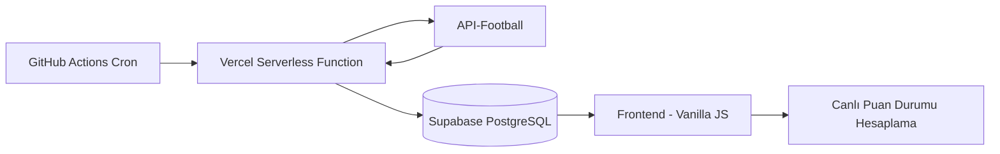

# ⚽ Live-Scorer / Mini Maçkolik

Live-Scorer, canlı futbol skorları, günlük maç listesi, fikstür, maç detayları ve anlık puan durumu gösteren bir web uygulamasıdır.

Bu projede amaç sadece API'den veri çekmek değil; API limitleri, veri önbellekleme, cron job, serverless endpoint ve Supabase tabanlı veri saklama gibi gerçek dünyada karşılaşılabilecek problemleri çözerek çalışan bir futbol veri sistemi oluşturmaktır.

---

## 🚀 Özellikler

- Günlük maçları listeleme
- Canlı skor ve maç dakikası takibi
- Canlı maçlara göre anlık puan durumu hesaplama
- Lig bazlı fikstür ve puan tablosu görüntüleme
- Seçili maçlar için olaylar ve istatistikler
- Süper Lig maç verilerini kalıcı olarak arşivleme
- Supabase üzerinde cache/veri ambarı mantığı
- GitHub Actions cron ile otomatik veri güncelleme
- Vercel serverless function ile güvenli backend endpoint
- Dark / light tema desteği
- Mobil uyumlu arayüz

---

## 🧠 Projenin Çıkış Noktası

İlk aşamada maç verileri doğrudan API üzerinden çekiliyordu. Ancak kullanılan ücretsiz API paketinde günlük istek limiti olduğu için bu yöntem sürdürülebilir değildi.

Bu problemi çözmek için veriler doğrudan kullanıcı tarafında API'den çekilmek yerine Supabase veritabanına kaydedildi. Kullanıcılar siteye girdiğinde verileri API'den değil, Supabase üzerinden okuyor.

Böylece:

- API limiti korunuyor
- Aynı veri tekrar tekrar çekilmiyor
- Site daha hızlı çalışıyor
- Canlı maçlar kontrollü şekilde güncelleniyor
- Maç bittikten sonra veriler kaybolmadan arşivleniyor

---

## ⚙️ Sistem Nasıl Çalışır?

1. GitHub Actions belirli aralıklarla çalışır.
2. GitHub Actions, Vercel üzerindeki serverless endpoint'i güvenli bir secret key ile tetikler.
3. Vercel endpoint'i API-Football üzerinden güncel maç verilerini çeker.
4. Günlük maçlar `daily_matches` tablosuna kaydedilir.
5. Öncelik algoritmasına göre seçilen 3 maç `selected_matches` tablosuna alınır.
6. Başlamış veya bitmiş seçili maçlar için olaylar ve istatistikler çekilir.
7. Süper Lig maçları ana `matches` tablosunda güncellenir.
8. Frontend verileri Supabase üzerinden okuyarak kullanıcıya gösterir.

---

## 🏗 Sistem Mimarisi

🗄 Veritabanı Yapısı

Projede temel olarak 4 tablo kullanıldı:

daily_matches

Günün maçlarını tutar. Günlük olarak temizlenir ve yeniden doldurulur.

selected_matches

Öncelik algoritmasına göre seçilen maçların olay ve istatistik verilerini tutar.

matches

Ana fikstür tablosudur. Lig, sezon, takım, skor, durum, tarih ve maç olayları gibi kalıcı verileri içerir.

lig_siralamasi

API veya maç verisi eksik olduğunda kullanılmak üzere yedek puan durumu verilerini tutar.

🚧 Karşılaşılan Problemler ve Çözümler
Problem: API İstek Limiti

Ücretsiz API paketinde günlük istek limiti olduğu için tüm kullanıcıların doğrudan API'ye bağlanması mümkün değildi.

Çözüm:
Veriler Supabase'e cache'lendi. Frontend doğrudan API yerine Supabase üzerinden veri okumaya başladı.

Problem: Vercel Ücretsiz Planda Cron Kısıtı

Vercel ücretsiz planda zamanlanmış görevleri kullanmak mümkün değildi.

Çözüm:
GitHub Actions üzerinde cron.yml oluşturuldu. Bu cron job, Vercel endpoint'ini belirli aralıklarla tetikledi.

Problem: Maç Detayları İçin Fazladan API Harcaması

Her maç için olay ve istatistik çekmek API limitini çok hızlı bitiriyordu.

Çözüm:
Sadece öncelik algoritmasına göre seçilen 3 maç için detay verisi çekildi. Maç başlamamışsa detay API çağrısı yapılmadı.

Problem: Canlı Puan Durumu

Canlı maçların skoru değiştikçe puan durumunun da anlık değişmesi gerekiyordu.

Çözüm:
Frontend tarafında matches tablosundaki bitmiş ve canlı maçlar üzerinden puan durumu dinamik olarak hesaplandı.

Problem: Takım İsimlerinin Farklı Gelmesi

API'deki takım isimleri ile veritabanındaki takım isimleri bazen farklı formatlarda geliyordu.

Çözüm:
Geçici olarak takım isimleri için eşleştirme sözlüğü kullanıldı. Gelecek geliştirmede takım ID bazlı daha sağlam bir yapı planlanıyor.

🛠 Kullanılan Teknolojiler
Frontend
HTML5
CSS3
JavaScript
Responsive Design
Backend
Node.js
Vercel Serverless Functions
REST API
Database
Supabase
PostgreSQL
JSONB veri yapısı
Row Level Security
DevOps
GitHub Actions
Cron Jobs
Environment Variables
Git / GitHub
🔐 Güvenlik

API key, Supabase service role key ve cron secret gibi gizli bilgiler kod içinde tutulmaz.

Bu bilgiler:

Vercel Environment Variables
GitHub Actions Secrets

üzerinden güvenli şekilde yönetilir.

Frontend tarafında sadece public/anon Supabase key kullanılır. Yazma işlemleri serverless backend üzerinden yapılır.

📸 Ekran Görüntüleri

  

  

  

🎯 Gelecek Planları
Kod yapısını modüler hale getirmek
Frontend tarafını React ile yeniden geliştirmek
Takım isimleri yerine takım ID bazlı veri modeli kurmak
selected_matches tablosunda olaylar ve istatistikleri daha temiz ayırmak
UI/UX tasarımını geliştirmek
Mobil uyumluluğu artırmak
PWA desteği eklemek
Takım ve lig bazlı detaylı istatistik sayfaları oluşturmak
👤 Developer

Mert Şahin Vergili

LinkedIn: https://www.linkedin.com/in/mert-vergili-10162539a/
GitHub: 
