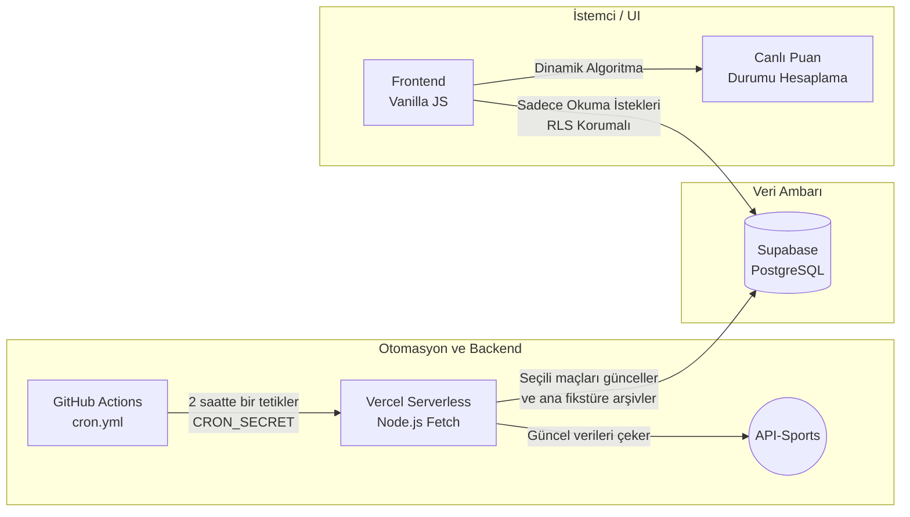

# ⚽ Live-Scorer (Mini Maçkolik) - Canlı Futbol Veri Ambarı

Live-Scorer, canlı maç skorlarını, maç olaylarını ve anlık puan durumlarını takip edebileceğiniz modern bir futbol veri platformudur. Bu proje, ücretsiz API limitlerini aşmak için **serverless mimari, veri önbellekleme (caching) ve zamanlanmış görevler (cron jobs)** kullanarak kendi ayakları üzerinde duran bir veri boru hattı (Data Pipeline) inşa eder.

---

## 🚀 Özellikler

- 📊 Günün tüm maçlarını ve anlık skorlarını listeleme
- ⚡ Canlı maçlar için maç dakikasına göre anlık güncellenen dinamik puan durumu
- 🧠 Seçili maçlar için detaylı istatistikler ve maç olayları (gol, kart, vb.)
- 🗄 Süper Lig maç bittiğinde verileri Supabase PostgreSQL ile kalıcı olarak arşivleme
- 🔄 GitHub Actions + Cron ile tamamen otonom ve maliyetsiz veri güncelleme
- 🔐 RLS (Row Level Security) ile güvenli veri erişimi

---

## ⚙️ Nasıl Çalışır?

* API günlük sadece 100 istek limiti sunar. Tüm kullanıcıları API'ye yönlendirmek sistemi dakikalar içinde kilitlerdi.
* **Tüm veriyi anlık çekmek yerine "Caching" mantığı kuruldu:**
  * GitHub Actions, Vercel'deki sunucusuz (serverless) fonksiyonu belirli aralıklarla (cron) gizli bir şifreyle (Secret Key) tetikler.
  * Sadece günün önemli maçları seçilir ve API'den veri çekilir.
  * Çekilen veriler anında kendi veritabanıma (Supabase) kaydedilir.
* Kullanıcılar siteye girdiğinde doğrudan API yerine **veritabanından (okuma yetkisiyle)** veri alır.
* **Böylece:** API limiti asla aşılmaz, site ışık hızında çalışır ve aynı veri binlerce kullanıcıya sorunsuz sunulabilir.

---

## 🏗 Sistem Mimarisi

🧠 Karşılaşılan Problemler & Çözümler
🚧 Problem: Kısıtlı Fikstür Verisi
Ücretsiz API katmanı, geçmiş sezon verilerini ve tüm fikstürü tek seferde sunmuyordu.
✅ Çözüm: Node.js ile özel bir bot yazılarak Süper Lig dahil 6 büyük ligin 4540 maçlık fikstürü Supabase veritabanına özel statülerle önceden aktarıldı.

🚧 Problem: Ücretsiz Sunucularda "Cron Job" Kısıtlaması
Vercel'in ücretsiz sürümünde, arka plan görevlerini tetikleyecek zamanlayıcı (cron) özelliği bulunmuyordu.
✅ Çözüm: GitHub Actions kullanılarak bir cron.yml oluşturuldu. Güvenli endpoint dışarıdan tetiklenerek veri boru hattı sıfır maliyetle otomatikleştirildi.

🚧 Problem: Kalıcı Veri Arşivleme (Data Persistence)
Geçici maç istatistiklerinin maç sonunda kaybolması riski vardı.
✅ Çözüm: Backend algoritması, maçlar bittiğinde bu geçici verileri (events) ana fikstür tablosuna kalıcı olarak yazacak (upsert) şekilde programlandı. Süper Lig'in 32. haftasından itibaren kendi spor veri setim kalıcı olarak oluşmaya başladı.

🛠 Kullanılan Teknolojiler
Frontend: HTML5, CSS3, JavaScript (Vanilla JS), Responsive Design

Backend: Node.js, Vercel Serverless Functions, REST API Integration

Database: Supabase (PostgreSQL), Veri Modelleme, RLS Koruması

DevOps / CI-CD: GitHub Actions (Cron Jobs)

📸 Demo

  

  

  

🎯 Gelecek Planları
Canlı skorlar için anlık bildirim (Push Notification) sistemi

Takım ve lig bazlı daha detaylı grafiksel istatistikler

UI/UX geliştirmeleri ve Mobil Uyumlu PWA (Progressive Web App) altyapısı

👤 Developer
Mert Şahin Vergili

LinkedIn Profilim:https://www.linkedin.com/in/mert-vergili-10162539a/

GitHub Profilim
